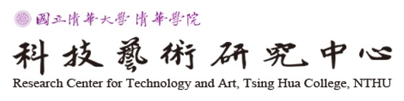
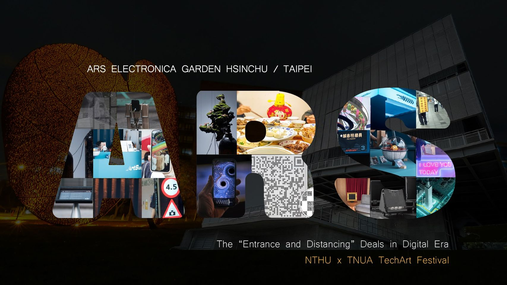
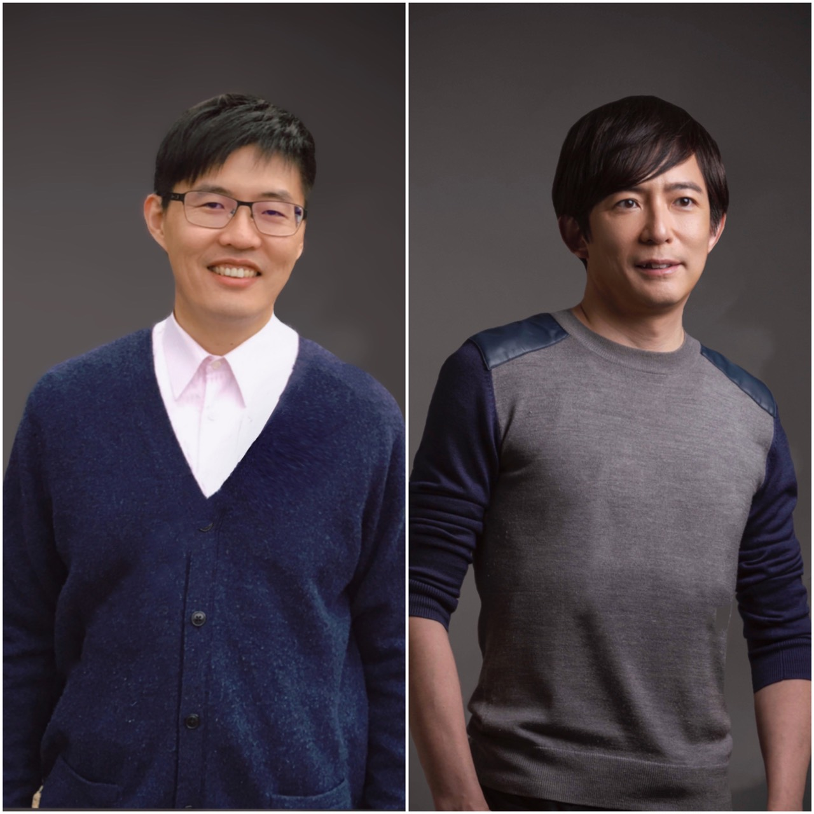

# Ars Electronica 2021
[](https://ars.electronica.art/newdigitaldeal/en/entrance-distancing-deals/?fbclid=IwAR1LmB6AC75l2ylXfFmy99nOf4rY1f6F20dCZ_xiFY2B4pvfv2I3IhYsCvU)

## The “Entrance and Distancing” Deals in the Digital Era
Center for Technology and Art, National Tsing Hua University - NTHU, (TW); Department of New Media Art, Taipei National University of the Arts - TNUA, (TW)

 


## Ars Electronica Garden Hsinchu / Taipei
[](https://techart-ars.tw/2021/?page_id=293)

# Medium . Permeation
Impressionism expressed the scientific meaning of "light" in artistic creation. The light color reflected by the luminous flux through the medium in the air became the concept of impressionists’ creation.

After collecting the web imagination of global citizens about COVID_19, we trained the generative model and let the computer randomly synthesize it. We adjusted various parameters during the training process making the results such as Dou Jia, Monet, Renoir , their style paintings.

Through this work the diffusion path of COVID_19 spreading the molecular of the virus through the air, just like the scattering phenomenon formed by light through the particles in the air. Color is exclusive to the humans’ world, and COVID_19 is also born with humans.

The colorful world we see in this work represents the equality of races on the earth. The array of 196 pictures represents 196 countries were invaded by the COVID_19. As human beings, none of us are spared from this disaster.

## Statement
[](https://www.youtube.com/embed/QZXdjV6TTPc)

## Artwork


## Gradual Change
[](https://www.youtube.com/embed/vpkR4jU1aec)

## Authors
### YuanFu Yang (楊元福)
#### International collegiate PHD program student in National Tsing Hua University, TW.
#### Data Scientist / tsmc
Born in Taipei, Taiwan in 1979. Yang is the Ph.D. student at National Tsing Hua University for his research on Artificial Intelligence (AI) to enhance human creativity. He joined Taiwan Semiconductor Manufacturing Company in 2006. Yang conducts research and production across fields such as defect inspection and yield prediction using deep learning techniques. Yang, himself, has been exploring the potential expansion of painting creativity through the AI and human experts.
### Iuan Kai Fang (房元凱)
#### International collegiate PHD program student in National Tsing Hua University, TW.
#### Master degree in lighting design from Parsons School of Design, NY. The other’s in interior design from Chung Yuan University, TW.
He has been engaged in interior design for nearly 20 years. His works have won numerous awards including Red Dot ,IF,etc. However, he just started to touch the field of AI Art . Currently, he is studying the technology of 2D single image automatic generates to a 3D model.



## Reference/Link
https://ars.electronica.art/newdigitaldeal/en/entrance-distancing-deals/?fbclid=IwAR1LmB6AC75l2ylXfFmy99nOf4rY1f6F20dCZ_xiFY2B4pvfv2I3IhYsCvU

https://techart-ars.tw/2021/?page_id=293

https://www.facebook.com/permalink.php?story_fbid=2944347522470150&id=1944000092504903

## Code

### Install dependencies

```
python -m pip install -r requirements.txt
```

This code was tested with python 3.7  

###  Train
This script is run at DGX-1 with 8 NVIDIA® Tesla® V100. We will use in the training tf.distribute.MirroredStrategy, that supports synchronous distributed training on multiple GPUs on one server. It creates one replica per GPU device. Each variable in the model is mirrored across all the replicas. These variables are kept in sync with each other by applying identical updates. Here is the simplest way of creating MirroredStrategy:

```
mirrored_strategy = tf.distribute.MirroredStrategy()
```
We used data parallelism to split the training across multiple GPUs to reduce model training time. Each GPU has a full replica of the neural network model, and the variables are updated synchronously by waiting that each GPU process its batch of data. Please refer to the following:

```
python main.py
```

## Script Introduction

```main.py``` is used to train our model at DGX-1.

```GAN.py``` is our model to learn the style and texture of covid-19 pictures in various countries.

```Linz2021.ipynb``` is in the form of a Jupyter Notebook as a simple display of model training and a Covid-19 image generator.

